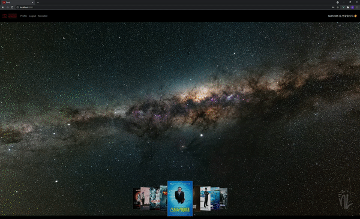
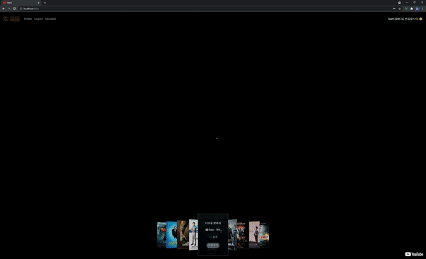
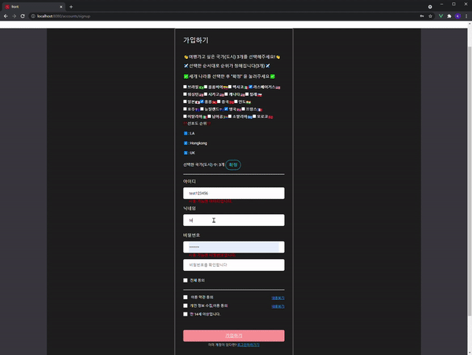
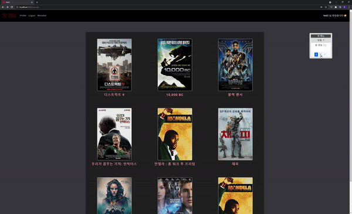
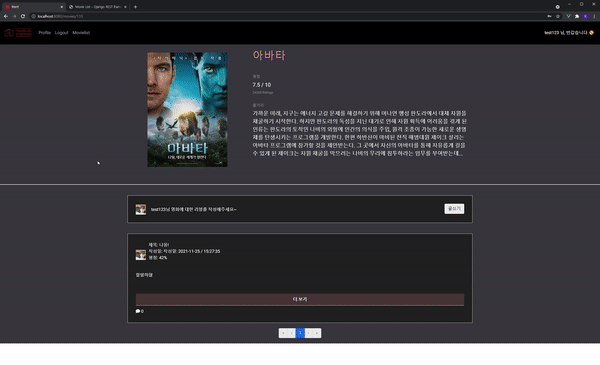
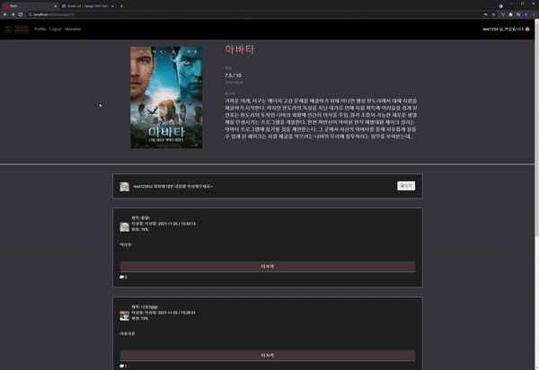
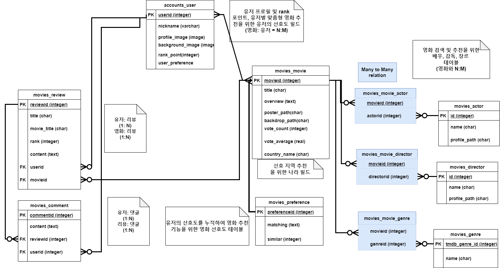
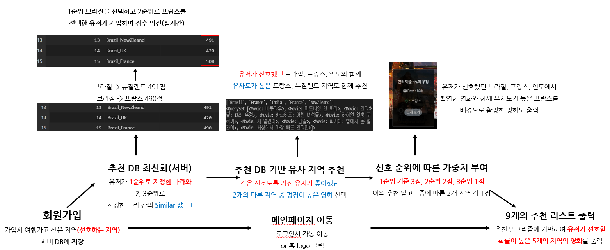

# SSAFY 1학기 최종 프로젝트

## "TIM" - 여행자를 위한 영화정보 기반 추천 서비스

> **Traveler In Movies**


## 개발 기간

- 2021.11.16 ~ 2021.11.25 (10일...)

> Django REST API + Vue.js 활용 영화 추천 및 커뮤니티 사이트입니다.
>
> 3​명의 ​팀원이 ​똘똘 ​뭉쳐도 :hourglass_flowing_sand:24시간이 모자라는 10일간의 대장정:mount_fuji: 끝에 리드미를 작성하게 되어 정말 감격스럽습니다...


## 결과물 Preview

- 메인 페이지 




- 메인 페이지 - 영화 선택




- 회원가입 페이지




- 영화 리스트 및 상세 페이지 




- 프로필 페이지


- 리뷰 게시판 (리뷰)



- 리뷰 게시판 (댓글)




### 프로젝트 컨샙

#### 1. 코로나로 인해 해외 여행이 제한 된 현대인에게 영화 페이지로 감성을 느끼게 해보자
- **가고 싶은 나라를 선택하면 해당하는 나라 배경의 영화 추천**
- **다른 유저의 나라 선호도를 함께 반영한 영화 추천하기**

#### 2. 미니멀한 스타일로 최소한의 UI 로 구성하기

- **메인 페이지에서 영화에 대한 전반적인 정보를 다 알 수 있도록 하기!**

#### 3. 영화 리뷰어만의 프로필 페이지 구성해보기

- **프로필에서 리뷰어가 쓴 영화의 장르, 나라 소개**
- **리뷰어가 자주 쓰지 않은 나라의 영화도 추천**


### 역할 분담

> 팀 전원 불스택:fire: 으로 하얗게 불태웠습니다... ​

#### :family_man_boy_boy: 팀장: 장지빈, 팀원: 안재현, 박기웅

##### **장지빈 - 프로젝트 수행 관리, 메인 페이지 구성 및 유저 선호도 기반 영화 추천, 소셜 로그인**

##### **안재현 - 회원가입 및 로그인, 영화 리스트 및 상세 페이지 (리뷰 및 댓글 CRUD 포함)**, 배포

##### **박기웅 - ERD 및 DB 기본 구성, 영화 정보 수집, 프로필 페이지 및 차트 기능, 리뷰 연동** 


### :hammer_and_wrench: 개발 환경

**A. 언어**

**i. Python 3.9**

**ii. Django 3.2.8**

**iii. Node LTS**

**iii. Vue.js 2**

**B. 도구**

**i. vsCode**

**ii. Chrome Browser**

**C.아키텍처**

**i. Django & Vanilla JS**

**ii. Django REST API 서버 & Vue JS (with Vuex)**


### 목표 서비스 구현 및 실제 구현 정도

#### :one: 메인페이지 (전체 완료)

- (완) 영화의 배경이 되는 나라 혹은 지역을 묶어서 DB에 적재 
  - 총 20개의 나라 및 지역 선정
  - 나라별 약 10개씩 영화를 묶어서 `TMDB API` 을 보내서 DB에 저장
- (완) 해당 지역의 고퀄 배경 영상화면 및 영화 정보와 같이 나오는 메인 페이지 구성
  - 영화 배경이 되는 나라의 4K 너튜브 영상 자동 시작
  - `Carousel` 형태의 추천 영화 리스트를 `Slide` 형식으로 구현
  - 카드 선택시 개별 영화의 세부 정보 출력
- (완) 회원가입 시 지역 선호도를 고려하여 메인페이지에서 9개의 영화 추천 
  - 회원 가입시 3개의 지역을 선택하는 설문조사 폼 출력
  - 유저의 선호도에 점수를 매겨 DB에 저장하고, 다른 유저가 회원가입시 이를 반영하여 영화 추천
- (완) 메인페이지 영화카드 상세 보기 클릭 시 포스터, 장르, 감독, 주연 정보 및 개요 출력 기능
  - 카드 앞/뒤면 `flip`하여 정보 분류하여 출력
  - 개별 영화의 포스터, 주요 장면(`backdrop`) 및 감독, 장르, 배우 정보 출력


#### :two: 회원가입 및 로그인

- (완) **회원 가입 시**  여행하고 싶은 국가 혹은 도시 3곳 선택해 DB에 저장 및 데이터 누적
  - 지역 확정 안하면 가입X
- (완) **회원 가입 시**  아이디 및 닉네임의 영문 대소문자 구문, 글자 수 구분 기능
  - 빈 값으로 넣을 시 알람
- (완) **회원 가입 시** 아이디 및 닉네임 기존 DB 정보와 일치 여부 확인
  - 일치하지 않으면 백엔드에서 경고 메시지 출력하고 프론트엔드에서 이를 받아서 보여줌
- (완) **회원 가입 시** 이용 약관 동의, 개인정보 수집 동의 버튼 및 전체 동의로 한번에 누르는 버튼 기능
- (완) **소셜 로그인** 연동
- (미완) 로그인 오류 시 아이디 혹은 비밀번호가 틀렸는지 유저에게 알려주는 기능
  - 	회원 정보 오류로 대체


### :three: 영화 리스트 페이지
- (완) 영화 리스트 전체 목록 및 Pagination 구성
- (완) 영화의 번호순(나라별), 평점순, 인기순 등으로 퀵 메뉴 버튼 및 정렬 기능


### :four: 영화 상세 페이지
- (완) 영화 기본 정보 출력 및 해당 페이지에서 리뷰 작성, 수정, 삭제 기능
- (완) 영화 리뷰 작성 게시판에 마크다운 형식 글, 이미지, 코드블럭 등 넣을 수 있는 기능
- (완) 리뷰 더보기 버튼을 통해 해당 리뷰에 대한 댓글 수 표시, 댓글 작성 및 삭제 기능
- (완) 영화 리뷰 작성/ 삭제 시 유저의 리뷰 포인트 증가 / 감소


### :five: 프로필 페이지

- (완) 프로필 사진 및 배경 사진 출력 및 수정 기능
- (완) 유저의 리뷰 정보를 활용하여 영화의 대표 장르와 지역 산출
  - `lodash`를 통해 DB에서 받아온 값을 `vue`에서 바로 계산
- (완) 유저의 최소 리뷰 지역에 해당하는 영화 중 하나 랜덤 추천
  - DB에서 지역에 해당하는 전체 영화 중 랜덤으로 하나를 출력
- (완) 유저의 리뷰 포인트 랭크 및 점수 상태 전체 티어를 `Modal`창으로  표시
  - `el-progressbar`를 통해 점수 상태 표시
- (완) 유저의 리뷰에 따른 영화 장르별, 나라별 통계 차트
  - `vue-chartjs`를 활용하여 `radar chart`로 구현
- (완) 유저의 전체 리뷰 목록 스크롤
- (미완) 유저의 영화 리뷰 점수 통계
- (미완) 회원 탈퇴 및 팔로워 - 팔로우 기능 


### 데이터베이스 모델링(ERD)




- **주요 모델 : 영화, 유저, 리뷰, 유저 선호도**

  - **1:N 관계 : 유저 - 리뷰, 영화 - 리뷰, 유저 - 댓글, 리뷰 - 댓글**

  - **N:M 관계: 장르 : 영화, 감독 : 영화, 배우 : 영화,** 

    

- **유저 선호도 모델 (`preference`)**

  - **로그인한 유저에게 선호 나라에 따라 영화를 추천하는 알고리즘을 활용하기 위해 만든 모델**

  - **사용자가 선택한 `user_preference`에 따라서 전체 사용자가 선호한 나라의 순위를 저장**

    

- **유저 리뷰 점수 업데이트**

  - **유저가 리뷰 작성시 포인트를 쌓을 수 있고 해당 유저 모델의 필드로 적용**


## 영화 추천 알고리즘

- **로그인 이전**


- **로그인 이후**


- **추천 알고리즘 개요 (가중치 그래프 알고리즘에서 착안한 방식)**



- **영화 모델의 선호도 테이블**

  ```python
  # movies/models.py
  class Preference(models.Model):
      matching = models.TextField(max_length=100)
      similar = models.IntegerField()
  ```

- **회원 가입 시 선호도에 따라 가중치 점수를 적재**

  ```python
  # movies/views.py
  '''
  메인 페이지(로그인 유저 선호도 기반)
  '''
  @api_view(['GET'])
  def movie_recommend(request, username):
      # 유저 선호한 나라 3개 목록 저장
      personal = User.objects.get(username=username)
      personal_pref = personal.user_preference
  
      # 마지막 공백 제거하며 리스트 형태로 저장 (['LA', 'UK', 'SouthAfrica'])
      personal_pref = personal_pref.split('.')[0:3]
  
      # 첫번째로 고른 나라와 매칭되는 나라 중 가장 similar 값이 높은 순으로 2개 출력하여 저장
      first_pref = Preference.objects.filter(matching__startswith=personal_pref[0]).order_by('-similar').first()
      second_pref = Preference.objects.filter(matching__startswith=personal_pref[0]).order_by('-similar')[1]
  
      # 매칭된 나라 이름만 저장
      first = first_pref.matching.split('_')[1]
      second = second_pref.matching.split('_')[1]
      new_nation_list = [personal_pref[0], personal_pref[1], personal_pref[2], first, second]
  
      # 선호순위 1, 2, 3순위 / 유저들의 선호도를 반영한 순위 1, 2위 순으로 가중치를 두고 choice
      recommend = random.choices(new_nation_list, weights=[3, 2, 1, 1, 1], k=9)
      rec = collections.Counter(recommend)
      count1 = recommend.count(personal_pref[0])
      count2 = recommend.count(personal_pref[1])
      count3 = recommend.count(personal_pref[2])
      count4 = recommend.count(first)
      count5 = recommend.count(second)
      print(count1, count2, count3, count4, count5)
      convert = {
          'Brazil':'브라질',
          'Colombia':'콜롬비아',
          'Mexico':'멕시코',
          'LA':'라스베이거스',
          'Washington':'워싱턴',
          'Chicago':'시카고',
          'Canada':'캐나다',
          'Chile':'칠레',
          'Japan':'일본',
          'Hongkong':'홍콩',
          'China':'중국',
          'India':'인도',
          'Australia':'호주',
          'NewZleand':'뉴질랜드',
          'UK':'영국',
          'France':'프랑스',
          'Italy':'이탈리아',
          'SouthAfrica':'남아프리카공화국',
          'Somalia':'소말리아',
          'Moroco':'모로코',
      }
  
      reco_movie1 = Movie.objects.filter(country_name=convert[personal_pref[0]]).order_by('-vote_avg')[0:count1]
      if count2:
          reco_movie2 = Movie.objects.filter(country_name=convert[personal_pref[1]]).order_by('-vote_avg')[0:count2]
          movies = reco_movie1 | reco_movie2
      if count3:
          reco_movie3 = Movie.objects.filter(country_name=convert[personal_pref[2]]).order_by('-vote_avg')[0:count3]
          movies = movies | reco_movie3
      if count4:
          reco_movie4 = Movie.objects.filter(country_name=convert[first]).order_by('-vote_avg')[0:count4]
          movies = movies | reco_movie4
      if count5:
          reco_movie5 = Movie.objects.filter(country_name=convert[second]).order_by('-vote_avg')[0:count5]
          movies = movies | reco_movie5
  
      serializer = MovieListSerializer(movies, many=True)
      return Response(serializer.data)
  ```

  

## 백엔드

### 전체 구조

- **pjt_final (프로젝트)**
- **account (프로필 정보 및 리뷰 포인트)**
- **movies (영화 정보 및 추천 서비스)**


### 배운 점

- 영화와 장르, 감독, 배우가 N:M으로 설정되어 있어 메인 페이지에서 개별 영화의 감독, 배우 정보를 불러올 때 쿼리 시간이 너무 오래걸려 페이지가 렌더링 되지 않는 문제가 발생

  - 해결 방법: 영화 모델에 따로 감독, 배우의 사진과 이름 필드를 추가 생성

  ```python
  class Movie(models.Model):
      # 장르와 N:M 관계
  	...
      
  class Director(models.Model):
      id = models.BigIntegerField(primary_key=True)
      movies = models.ManyToManyField(Movie, related_name='directors')
  ```

  :arrow_down_small:

  ```python
  class Movie(models.Model):
      # aditional data
      director_path = models.CharField(max_length=500)
      director_name = models.CharField(max_length=100)
      actor1_path = models.CharField(max_length=500)
      actor1_name = models.CharField(max_length=100)
      actor2_path = models.CharField(max_length=500)
      actor2_name = models.CharField(max_length=100)
      actor3_path = models.CharField(max_length=500)
      actor3_name = models.CharField(max_length=100)
      actor4_path = models.CharField(max_length=500)
      actor4_name = models.CharField(max_length=100)        
      actor5_path = models.CharField(max_length=500)
      actor5_name = models.CharField(max_length=100)
  ```

  

- 각 나라에 해당하는 한개의 랜덤 영화를 조회하기 위해 DB에서 랜덤으로 뽑는 `order_by('?')` 활용

  ```python
  # movies/views.py
  '''
  나라별 랜덤 영화 조회
  '''
  import random
  @api_view(['GET'])
  # @permission_classes([AllowAny])
  def randomMovie(request, country_name):
      # DB에서 랜덤하게 하나 뽑아줌!
      movie = Movie.objects.filter(country_name=country_name).order_by('?')[:1]
      # movie = random.sample(movies, 1)
      moviedata = serializers.serialize('json', movie)
      return HttpResponse(moviedata, content_type="text/json-comment-filtered")
  ```

  

- 백엔드에서 회원가입 요청 시 이미 존재하는 아이디 혹은 닉네임인 지 확인하는 방법

  - Django ORM으로 일치 여부 확인하고 `Response` (`from rest_framework.response import Response` )을 통해 error 메시지를 보내줌

  ```python
  # accounts/views.py
  @api_view(['GET', 'PUT', 'DELETE'])
  def profile(request):
      # profile 조회
      if request.method == 'GET':
          serializer = UserProfileSerializer(request.user)
          return Response(serializer.data)
  
      # profile 수정
      elif request.method == 'PUT':
          # profile 이미지 받기
          profile_image = request.data.get('profile_image')
          print(profile_image)
          # background 이미지 받기
          background_image = request.data.get('background_image')
          print(background_image)
  
          # 별명 수정 시 일치여부 검사
          if request.user.nickname != request.data.get('nickname') and User.objects.filter(nickname=request.data.get('nickname')).exists():
              return Response({'error': '이미 존재하는 별명입니다.'}, status=status.HTTP_400_BAD_REQUEST)
  
          
          serializer = UserProfileSerializer(request.user, data=request.data)
          if serializer.is_valid(raise_exception=True):
              print('serializer is valid!')
              serializer.save(profile_image=profile_image, background_image=background_image)
              return Response(serializer.data)
  ```


- 현재 유저의 리뷰 -> 해당하는 영화 -> 장르 혹은 나라의 개수를 세는 방법

  - Django ORM을 통해 해당하는 쿼리셋을 뽑은 뒤 `list` 형태로 만들어 파이썬 문법으로 Json 형식으로 만들어서 응답 객체를 반환

  ```python
  # accounts/views.py
  @api_view(['GET'])
  @permission_classes([AllowAny])
  def reviews_country(request, user_pk):
  
      # Genre to query set list
      countries = ['브라질', '콜롬비아', '멕시코', '라스베이거스', '워싱턴', '시카고', '캐나다', '칠레', '일본', 
      '홍콩', '중국', '인도', '호주', '뉴질랜드', '영국', '프랑스', '이탈리아', '남아프리카공화국', '소말리아', '모로코']
      
      # 장르 개수 초기화
      countries_cnt = {}
      for country in countries:
          countries_cnt[country] = 0
  
      # 리뷰 조회
      if request.method == 'GET':
          reviews = [review for review in Review.objects.filter(user__pk=user_pk).order_by('-pk').values()]
          for review in reviews:
              countries = [movie['country_name'] for movie in Movie.objects.filter(id=review['movie_id']).values()]
              for country in countries:
                  countries_cnt[country] += 1
      
      return JsonResponse(countries_cnt)
  ```


## 프론트엔드

### 전체 구조

- **App.vue (navbar, logout 및 JWT 토큰)**
- **views/accounts (회원 가입, 로그인, 프로필 페이지)**
- **views/main (메인 페이지 및 추천 페이지)**
- **views/movies (영화 리스트, 리뷰, 댓글)**

- **store/index.js(vuex 기반 중앙 저장 및 메서드 관리)**


### 배운 점

- **vue-chartjs 를 통해 차트 그려보기**
  - 공식문서와 우리 프로젝트가 상이하여 이해하는데 한참 걸렸지만 기본적으로 `dataset`과 `labels`로 x,y 축만 맞춰주면 그려짐!

```vue
<script>
import {Radar} from 'vue-chartjs'

export default {
  extends: Radar,
  props: {
    dataset: Object,
  },
  data () {

    return {
      dataCollection: {
         // 데이터 라벨링
        labels: Object.keys(this.dataset),
        datasets: [
          {
              label: '영화 수',
              // 입력 데이터
              data: Object.values(this.dataset),
              fill: true,
...

      },
      chartOptions: {

...

  },

...
  // 차트 그려주기
  mounted() {
    this.renderChart(this.dataCollection, this.chartOptions, {responsive: true, maintainAspectRatio: false, onClick:this.handle})
    
  },
  methods: {
    handle (point, event) {
      console.log(event)
      const item = event[0]
      this.$emit('on-receive', {
        index: item._index,
        value: item._index
      })
    }
  },
}

</script>
```


- SweetAlert로 모달창 쉽게 만들기

  - 모자라는 프로젝트 시간을 단비같이 아껴준 써드 파티를 활용한 모달창 구현하기

  ```vue
      isValid() {
        if (this.rank_point < 200 && ( this.sliderValue < 20 || this.sliderValue > 80) ) {
          Swal.fire({
              title: '<strong><u>더 강해져서 돌아오세요...?!</u></strong>',
              html: '<span style="color:red">골드 미만은 20~80점만 가능합니다!</span>',
              imageUrl: this.rankTierImage,
              imageWidth: 1400,
              imageHeight: 400,
              padding: '1em',
              imageAlt: 'Custom image',
            })
          
        } else {
          this.createAction()
        }
      },
  ```

  

## 느낀점

- 내가 겪은 모든 문제점은 이미 다른사람들이 한번씩 겪었던 문제다

어느 부분에서 문제가 생겨 진행이 되지 않을 때 보통은 될때까지 혼자 생각하는 편이었는데 도저히 문제가 해결될 기미가 보이지 않는다면 공식문서를 확인하고, 적극적으로 서칭하거나 팀원에게 도움을 요청하는 편이 빠르다. 내가 처한 상황은 팀원에게도 똑같이 일어났고, 혹은 인터넷 상의 누군가에게 일어난 문제다. 공식문서와 stack overflow에 없는 정보는 없다.


- 기획과 설계 과정의 중요성

구현보다 더 중요한 것이 기획과 설계라는 것을 느꼈다. 단순히 화면을 구성하는 것은 어느정도 시간을 들이면 다 가능했지만, 특정 페이지나 서비스를 제공할 때 로딩이 느려지거나 데이터를 가져오는데 실패하면 아무런 반응이 나타나지 않는 등 몇가지 보완점이 있었다. 단순히 한 개의 쿼리를 날릴 때 데이터를 우겨넣지 말고, 가장 효율적으로 트래픽을 적게 사용하면서 유저의 사용자 경험을 증진시킬 수 있는 서비스에 대한 고민을 해야함을 느꼈다.


- 프론트엔드도 설계가 중요하다. 

처음에 아무 생각없이 둥둥 띄어 놓은 div 태그들을 한꺼번에 수습하려고 하니 생각보다 엄청난 시간이 소모되었다. 백엔드 설계할 때만 해도 종이에다가 열심히 그리고 생각해보고 했는데, 프론트는 그런 것 없이 하다보니 페이지 구성을 변경 하고 싶을 때 마다 마구 뒤엉키는 경험을 하였다. 페이지 구성도 알고리즘 문제 풀 듯이 손으로 그려보고 머리로 정리해서 구성한다음 코드로 구현해야 됨을 느꼈다.


- 무지성으로 이것 저것 다 시도해보지 말고 공식 문서 보고 이해하고 시도하기

먼가 오류를 발견할 때마다 스택오브 플로우를 쥐잡듯이 잡아서 해결해왔는데 막상 되도 이게 왜 되지 싶을 때가 많았다. 이런 경우 문제가 비슷한 방식의 문제가 생겼을 때 또 같은 시간의 검색 시간을 통해 문제를 해결하게 되어 멍청한 짓을 한무 반복하는 결과로 시간이 줄줄 새버리게 된다. 문제가 발생했을 때는 꼭 공식문서를 보고 학습한다음 머릿속에서 이해한 나의 방식으로 접근하는 습관을 들여야 되겠다.


- 경로의존성에 의한 어려움

java spring로 작업했을 땐, sql 방식으로 db의 데이터를 불러왔는데 django는 orm 방식을 사용하다보니 원하는 값을 불러오는데에 어려움이 있었습니다. jquery로 최적화된 api를 사용하고 싶을 경우 해당 코드를 다시 vue 방식으로 리팩토링을 하거나 도저히 변경이 불가능하여 그대로 jqery를 함께 사용한 경우가 있었는데 두개를 동시에 사용할 때 구조가 복잡해서 방법을 찾느라 초반에 시간이 많이 걸렸습니다. 


- REST API와 Vue.js 를 더 학습해야겠다

rest api와 vue.js를 사용하여 프론트와 백을 나눠서 했기 때문에 데이터를 어디서 어떻게 받아오는지 익숙해지는데 오래걸렸습니다. Vue를 배운 시간과 특히, vuex에 대한 이해가 부족해서 설계가 부족해서 꼬이는 부분이 많았습니다. 재활용보다는 무지성으로 중복 코드를 구현하게 되어 심도 있는 학습한 후 다시 설계 해보고 싶습니다!


- 구현보다 배포가 더 어렵네요

배포에서 백앤드 배포는 크게 어렵지 않았으나 프론트앤드 배포는 강의를 들은 적이 없어서 혼자서 찾아보며 해결하느라 많이 어려웠습니다. 개인적으로 프로젝트 제작보다 AWS를 이용한 프론트, 백앤드를 한 곳에서 배포하는 것이 더 힘들었던 것 같습니다.
